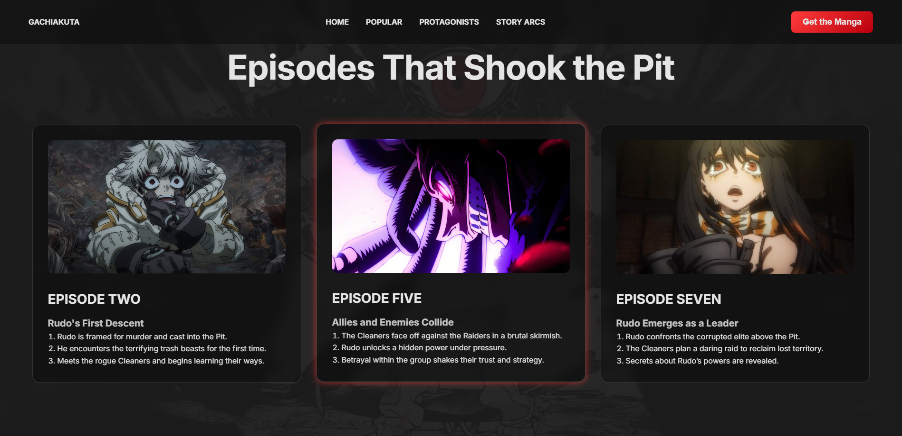
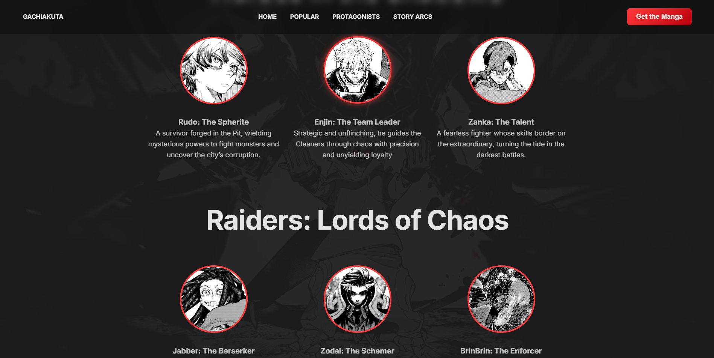
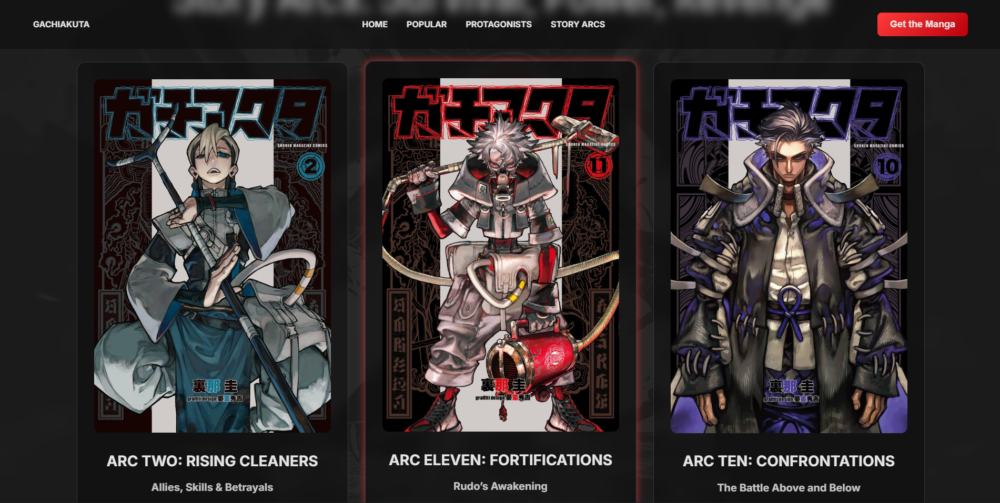

# Gachiakuta WebPage Notes
This project is a static landing page inspired by the manga **Gachiakuta**.
The goal was not just to create an anime-style page but to practice **clean layout, modular CSS architecture and scalable front-end structure**.

This site prioritizes:
- Clear visual hierarchy
- Reusable UI patterns
- Maintainable CSS organization
- Professional project structure

# Goals
- Practice building a full landing page from scratch
- Improve layout and typography fundamentals
- Learn how to structure CSS for scalability
- Avoid overengineering (no frameworks, no preprocessors)
- Treat the project like a real deliverable and not a demo

# Tech Stack
- HTML5 (semantic sections)
- CSS3 (modular architecture)
- Font Awesome (icons)
- No JavaScript (intentional)


# CSS Architecture
The CSS is split into logical modules to keep responsibilities clear and separate:

```text
css/
├── base/        → resets, typography, global styles
├── layout/      → structural sections (navbar, hero, footer)
├── components/  → reusable UI elements (buttons, cards, social)
├── images/       → page-specific images
└── style.css    → main entry file
```

# Home
The Home page introduces the site with a clean and visually appealing hero section featuring the protagonist and the main title.
It highlights:

* A prominent hero banner
* Clear navigation
* Immediate visual context from the manga

[](./doc-images/Home.png)

# Episodes
The Episodes page lists individual episodes in a clean, grid-style layout.
It emphasizes:

* Easily scannable episode cards
* Hover effects for interactive feedback
* Consistent typography and spacing

[](./doc-images/Episodes.png)

# Profiles
The Profiles page showcases character profiles with images, names and descriptions.
It focuses on:

* Structured, readable card layout
* Visual hierarchy for key information
* Modular styling to reuse profile cards

[](./doc-images/Profiles.png)

# Arcs
The Arcs page organizes story arcs chronologically, providing a high-level overview of major plotlines in the story.
It includes:

* Arc cards with images and subtitles.
* Clear separation of story sections
* Easy navigation through multiple arcs

[](./doc-images/arcs.png)
